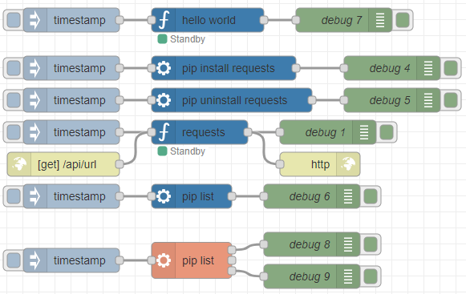
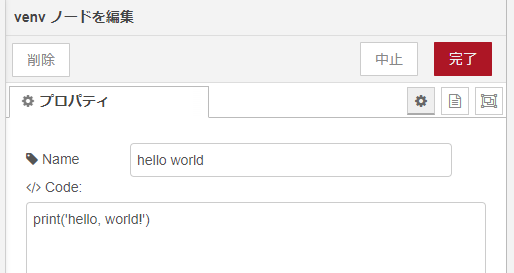
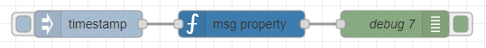
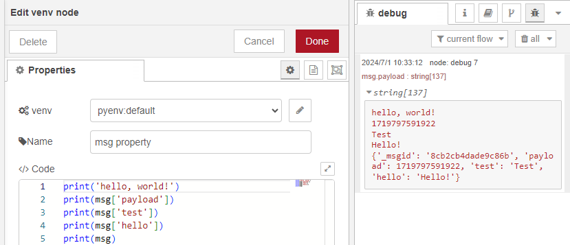
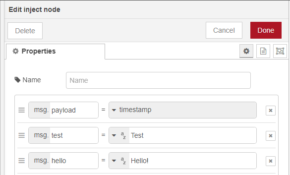
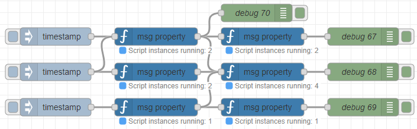
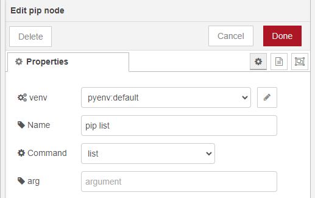
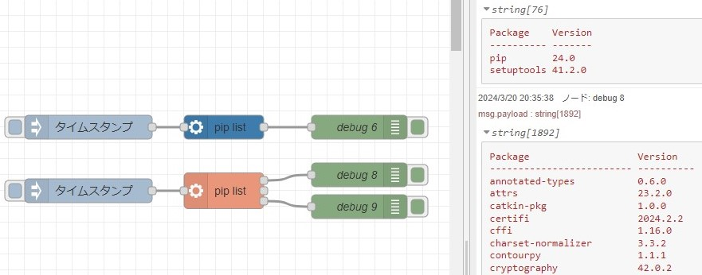
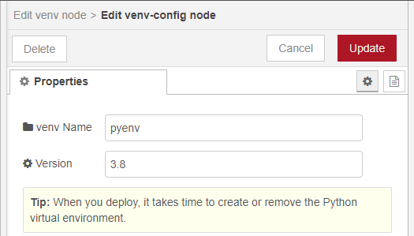
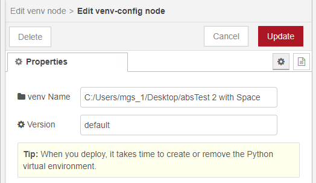

# node-red-contrib-python-venv

Node for python virtual environment

## Overview

With this node, you can run Python programs.

When you install this node, python virtual environment (pyenv folder) is also created.  
You can run python(.exe) or pip(.exe) in that environment.

## Test Case

Windows 10

- Node.js: v20.10.0
- npm: 9.1.3
- Python: 3.8.3
- pip: 24.0

Sample flows are in the examples folder.  

## Nodes

### venv node

python(.exe) is in the ./pyenv/Scripts/python.exe or Python virtual environment you have added.

Write your Python code in the node.  
The program is saved in the virtual environment and executed.

You can access Node-RED messages like `print(msg['payload'])`.

The number of running nodes is displayed in the status.

### pip node

pip(.exe) is in the ./pyenv/Scripts/pip.exe or Python virtual environment you have added.

You can run pip commands like install, uninstall, list.  
Select the commands.

This node uses pip in the virtual environment, so it is different from the existing Python environment packages.  
Please compare.

### venv-config (config node)

You can create and switch between multiple Python virtual environments.  
You need to add and set the name of the virtual environment.  
You can also specify the Python version **only in Windows**.  

When a configuration node is deleted, the virtual environment with that name is also deleted.  
If you add a node with the same venv Name, only one virtual environment will be created.

The nodes can be executed by creating virtual environments even if the venv Name contains spaces or is an absolute path.  

## Other Links

### Technical Articles

I refer to "Creating Nodes" page of Node-RED.  
<https://nodered.org/docs/creating-nodes/>

My article about python-venv (version 0.0.2)  
In Japanese: Node-REDのノードを作成してみる　その１（python-venv）  
<https://404background.com/program/node-create-python-venv/>  
In English: Creating Nodes for Node-RED Part 1 (python-venv)  
<https://404background.com/en/programming/creating-nodes-1/>

### Nodes created based on this node

voicevox-core node: Node that outputs Japanese audio files using voicevox-core  
<https://flows.nodered.org/node/@background404/node-red-contrib-voicevox-core>

whisper node: Node to transcribe text using Open AI's Whisper  
<https://flows.nodered.org/node/@background404/node-red-contrib-whisper>
