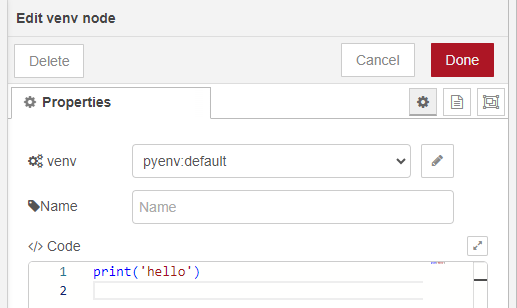
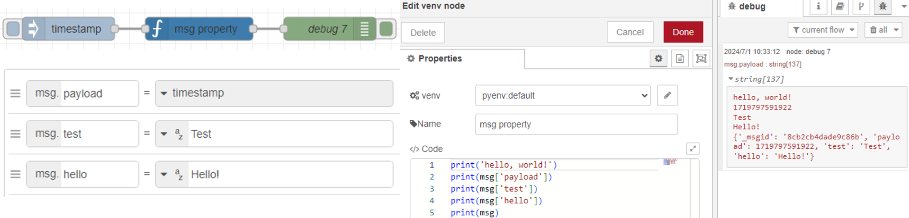

# node-red-contrib-python-venv

Node for python virtual environment

## Overview

With this node, you can run Python programs.  

When you install this node, python virtual environment (pyenv folder) is also created.  
You can run python.exe or pip.exe in that environment.

## Test Case

Windows 10

- Node.js: v20.10.0
- npm: 9.1.3
- Python: 3.8.3
- pip: 24.0

Raspberry Pi

- Debian bookworm
- Node.js: v18.19.0
- npm: 9.2.0
- Python: 3.11.2
- pip: 24.0

Sample flows are in the examples folder.  

## Nodes

### venv node

python.exe is in the ./pyenv/Scripts/python.exe  

Write your Python code in the node.  
The program is saved in a tmp folder and executed.  

You can access Node-RED messages like `print(msg['payload'])`.

### pip node

pip.exe is in the ./pyenv/Scripts/pip.exe  

You can run pip commands like install, uninstall, list, etc.  
Select the options.  

This node uses pip in the virtual environment, so it is different from the existing Python environment packages.  
Please compare.  

### venv-config (config node)

You can create and switch between multiple Python virtual environments.  
You can also specify the Python version only in Windows.  

If not selected in venv and pip nodes, the virtual environment named pyenv will be used.  
When a configuration node is deleted, the virtual environment with that name is also deleted.  

If you add a node with the same venv Name, only one virtual environment will be created.  

